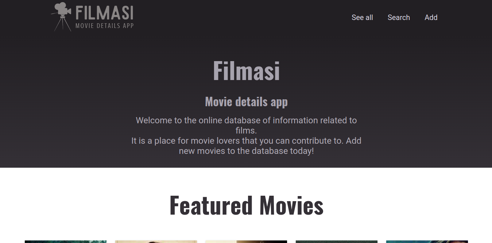
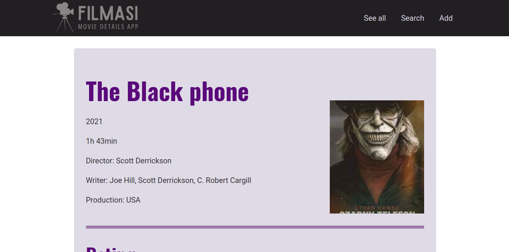
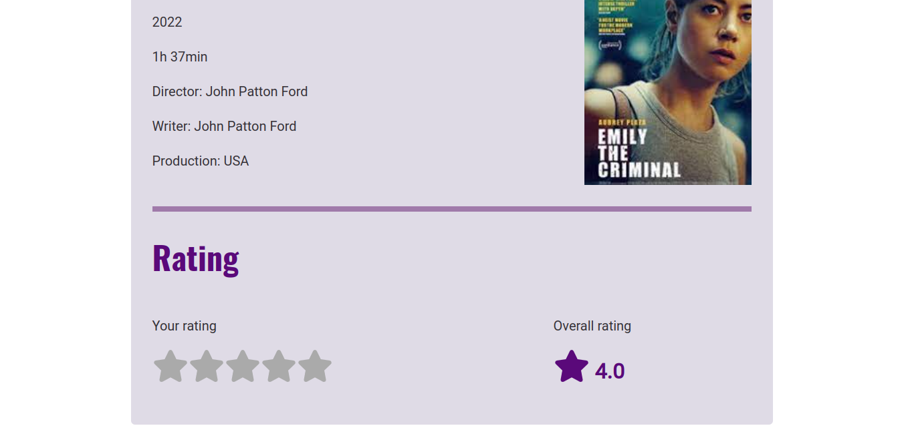

# 🎥 Filmasi - movie app

### Description

Filmasi - the movie details app created with using Next.JS, JavaScript, MongoDB, CSS Modules.

It's a website with a catalog of movies where user can rate them. The ratings are stored in MongoDB and the average of the ratings is calculated and displayed.

### Preview

###### Home page

###### Views of single movie

###### Views of rating section in single movie page

